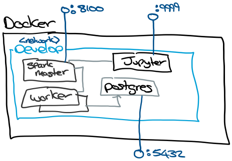

# Building A Development Spark Cluster with Docker

## Overview

My goal is to build a decent approximation of a production Apache Spark EMR environment for development and testing.

For development, I need:

* A Postgres database to persist datasets.
* A Spark cluster with two worker nodes.
* A Jupiter notebook server for prototyping.
* A Shared filesystem for file processing.

    The approach I've taken is to run everything on Docker to avoid building up an environment from scratch.

    The Docker setup has a `develop` network where all of the containers run. To support development, I've exposed the Spark UI, Jupter and Postgres ports. Spark UI is exposed on 8100 and Jupyter is on 9999, I use non-standard ports to avoid conflicts with other stuff on the host machine.

    

## Building the environment

```bash
# Clone the repo
git clone https://github.com/omahoco/spark-postgres.git

# Create the environment
cd spark-postgres
make all
```

## Testing via Jupyter

Navigate to http://localhost:9999. Jupyter will ask you for a token for authentication.

To get the authentication token from the Jupiter server.

```bash
cd spark-postgres
make jupyter_token
```

In Jupyter, you can test connectivity to the spark master using the following code.

```python
import pyspark

conf = pyspark.SparkConf().setAppName('Jupyter').setMaster('spark://spark:7077')
sc = pyspark.SparkContext(conf=conf)
session = pyspark.sql.SparkSession(sc)


rdd = sc.emptyRDD()
print(rdd.isEmpty())

sc.stop()
```

Next, let's test connectivity to Postgres by counting the number of Postgres users.

```python
import pyspark

conf = pyspark.SparkConf().setAppName('Postgres').setMaster('spark://spark:7077')
sc = pyspark.SparkContext(conf=conf)
session = pyspark.sql.SparkSession(sc)

jdbc_url = 'jdbc:postgresql://postgres/postgres'
connection_properties = {
'user': 'postgres',
'password': 'postgres',
'driver': 'org.postgresql.Driver',
'stringtype': 'unspecified'}

df = session.read.jdbc(jdbc_url,'pg_catalog.pg_user',properties=connection_properties)

print(df.count())

sc.stop()
```

## Spark Working With Files

The Spark and Jupyter containers mount the hosts `/tmp` folder to `/data`. The mount acts as a shared file system accessible to both Jupyter and Spark. In a production environment a network file system, S3 or HDFS would be used.

In the example below, we download the dataset and ask Spark to load it into a Dataframe. Next, we use an aggerate function to calculate the average systolic blood pressure from the sample.

From a Jupyter notebook:

```python
!curl https://raw.githubusercontent.com/omahoco/spark-postgres/master/nhanes_2015_2016.csv -O /data/nhanes_2015_2016.csv
```

```python
import pyspark

conf = pyspark.SparkConf().setAppName('Jupyter').setMaster('spark://spark:7077')
sc = pyspark.SparkContext(conf=conf)
session = pyspark.sql.SparkSession(sc)

# Load Some NHANYES Data - https://www.cdc.gov/nchs/nhanes/index.htm
nhanyes_df = session.read.format('csv').option("header", "true").load('/data/nhanes_2015_2016.csv')

from pyspark.sql.functions import mean as _mean, stddev as _stddev, col

# BPXSY2- Systolic: Blood pressure (second reading) mm Hg
stats_df = nhanyes_df.select(
_mean(col('BPXSY2')).alias('BPXSY2_mean'),
_stddev(col('BPXSY2')).alias('BPXSY2_std')
).collect()

stats_df
```

The output should be `[Row(BPXSY2_mean=124.78301716350497, BPXSY2_std=18.527011720294993)]`

## Spark Working With Tables

In this example, we will create a Postgres table to track virtual coin tosses. We will use the table and Spark to calculate the frequency we get heads or tails over a million coin tosses.

### Creating Random Data

Connect to Postgres and get a terminal to enter interactive queries

```bash
docker exec -it postgres /bin/bash
psql --user postgres
```

Inside `psql` let's generate 1 million random coin toss events.

```sql
CREATE TABLE public.coin_toss (
event_ts timestamp default now(),
outcome TEXT NOT NULL
);

INSERT INTO public.coin_toss(outcome)
SELECT CASE WHEN RANDOM() < 0.5 THEN 'heads' ELSE 'tails' END FROM generate_series(1, 1000000);
```

### Calculating the Frequencies With Spark

```python
import pyspark

conf = pyspark.SparkConf().setAppName('Postgres').setMaster('spark://spark:7077')
sc = pyspark.SparkContext(conf=conf)
session = pyspark.sql.SparkSession(sc)

jdbc_url = 'jdbc:postgresql://postgres/postgres'
connection_properties = {
'user': 'postgres',
'password': 'postgres',
'driver': 'org.postgresql.Driver',
'stringtype': 'unspecified'}

df = session.read.jdbc(jdbc_url,'public.coin_toss',properties=connection_properties)

samples = df.count()
stats = df.groupBy('outcome').count()

for row in stats.rdd.collect():
print("{} {}%".format(row['outcome'], row['count'] / samples * 100))

sc.stop()
```

## Running A Spark Job

Instead of driving everything from a Jupyter notebook, we can run our Python code directly on Spark by submitting it as a job.

I've packaged the coin toss example as a Python file at `pyspark/src/main.py`.

We can submit the code as a job to spark by running:

```bash
make spark-submit
```
